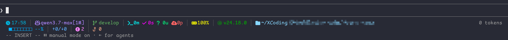

<div align="center">

# 🌌 Claude Code Statusline Theme

**Cyberpunk-themed status line with 24-bit true color and tech icons**

[中文](README.zh-CN.md) | English



</div>

---

## ✨ Components

### Line 1

| Module | Description |
|:------:|-------------|
| ⏰ **Time** | Current time in HH:MM format |
| 🤖 **Model** | Active Claude model (Sonnet / Opus / Haiku) |
| 🌿 **Branch** | Current git branch name |
| 📊 **Git Counts** | `Xm Xs Xu Xp` — modified / staged / untracked / unpushed, colored cyan / magenta / green / coral |
| 🔋 **Battery** | macOS battery % with charging / low / full state icons |
| 🟢 **Node.js** | Current Node.js version |
| 📂 **Directory** | Working directory path (`~` for home) |

### Line 2

| Module | Description |
|:------:|-------------|
| 📈 **Context Window** | Progress bar with remaining % |
| 🔄 **Tokens** | Input / Output with k/M suffixes |
| 🔌 **MCP** | Connected MCP server count |
| 🪝 **Hooks** | Active hooks count (global + project) |

---

## 🚀 Usage

```bash
# 1. Copy the script
cp statusline-nerd.sh ~/.claude/statusline-nerd.sh
chmod +x ~/.claude/statusline-nerd.sh
```

Add to `~/.claude/settings.json`:

```json
{
  "statusLine": {
    "type": "command",
    "command": "~/.claude/statusline-nerd.sh"
  }
}
```

Restart Claude Code and enjoy ✨

---

## 📋 Requirements

- `jq` — JSON parser
- **Nerd Font** (e.g., MesloLGS NF, JetBrains Mono Nerd Font)
- True color terminal (`COLORTERM=truecolor`)

---

## 📄 License

MIT
